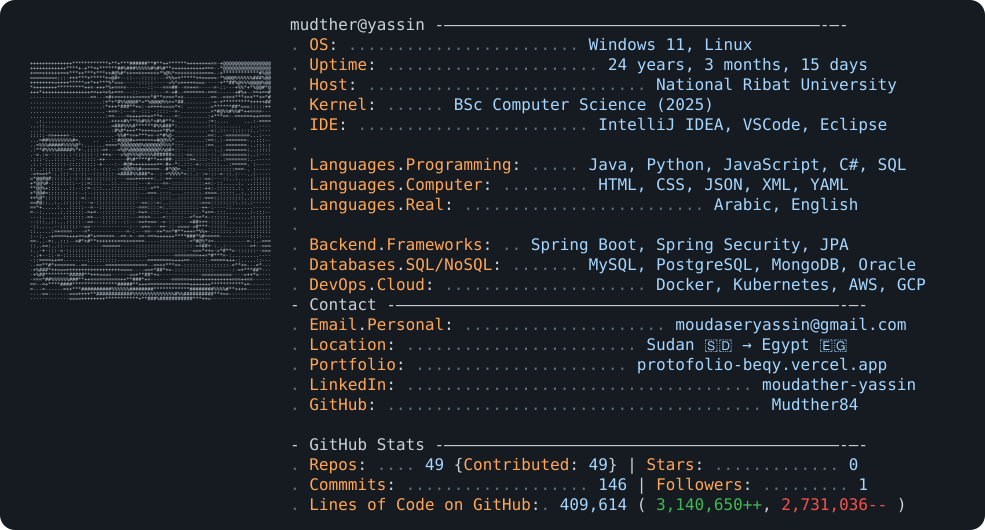

### 📊 Live Statistics

<pre>
moudather-yassin@github:~$ cat profile.txt

👋 Hi there, I'm Mudther | مرحبًا، أنا مدثر
───────────────────────────────────────────────────────

🎯 Role: Full-Stack Developer | Back-End Engineer
🎓 Education: BSc Computer Science - National Ribat University (2025)
📍 Location: Sudan 🇸🇩 → Egypt 🇬
💼 Focus: Java Spring Boot, Microservices, RESTful APIs

⚙️ Technical Skills:
  Back-End:     Java, Spring Boot, Spring Security, JPA/Hibernate
  Databases:    MySQL, PostgreSQL, MongoDB, Oracle, Redis
  DevOps:       Docker, Kubernetes, AWS, CI/CD (Jenkins, GitHub Actions)
  Security:     JWT, OAuth2, RBAC, OWASP Best Practices
  Architecture: Microservices, Clean Architecture, DDD, SOLID
  Testing:      JUnit, Mockito, Testcontainers, Postman

🛠️ Tech Stack:
  ■ Java ■ Spring Boot ■ MySQL ■ PostgreSQL
  ■ MongoDB ■ Docker ■ Kubernetes ■ AWS
  ■ Git ■ GitHub Actions ■ Jenkins ■ Redis

🚀 Featured Projects:
  ❯ Booking App (Spring Boot + MySQL + Frontend)
  ❯ Student Management System (RESTful API)
  ❯ E-commerce API (JWT Auth + Swagger)
   Portfolio Website (Full-Stack)

 Connect with me:
   Email: moudaseryassin@gmail.com
  💼 LinkedIn: /in/moudather-yassin
  🌐 Portfolio: protofolio-beqy.vercel.app

───────────────────────────────────────────────────────
"The first rule of programming: If it works, don't touch it" 😄
</pre>

### 📊 GitHub Statistics

<table>
  <tr>
    <td valign="top" width="50%">
      
    </td>
    <td valign="top" width="50%">
      
    </td>
  </tr>
  <tr>
    <td valign="top" colspan="2" align="center">
      
    </td>
  </tr>
</table>

### 🏆 GitHub Trophies

###  Contribution Graph

---

###  Currently Working On

